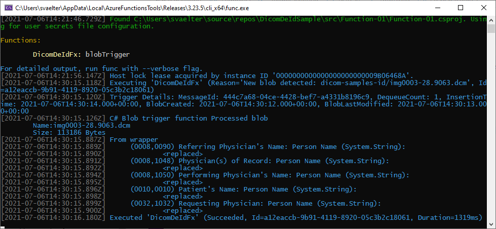

# DICOM De-Identification Sample

A sample Azure Function that de-identifies DICOM files by removing tags from new blobs added to Azure Storage.

This sample uses the [fo-dicom](https://github.com/fo-dicom/fo-dicom) .NET library to process the DICOM files.

## Running Locally
Pre-reqs: Azurite or the Azure Storage Emulator (deprecated)

1. Open the solution in Visual Studio (2019 or later).
2. Ensure the startup project is set to `Function-01`. 
3. Start the VS debugger for the function project.
4. Using Storage Explorer, send one or more DICOM files with tags to the source container identified in the code: `dicom-samples-id`.
5. You should observe output from the Verbose logger in the VS debug window:


### Setting up Azurite

With the deprecation of the Azure Storage Emulator, Azurite is the recommended method for emulating Azure Storage locally.

The command below will set up an Azurite Docker container with the configuration that matches the local.settings.json file in the Function app.

```
docker run -p 10003:10000 -p 10004:10001 -p 10005:10002 -v [your folder]:/data -d -e AZURITE_ACCOUNTS="somclnrschsaeusprodprumd:Eby8vdM02xNOcqFlqUwJPLlmEtlCDXJ1OUzFT50uSRZ6IFsuFq2UVErCz4I6tq/K1SZFPTOtr/KBHBeksoGMGw==" --name azurite-dicomdeidfx mcr.microsoft.com/azure-storage/azurite
```

*(To avoid conflicts, a dedicated container is deployed.)*
